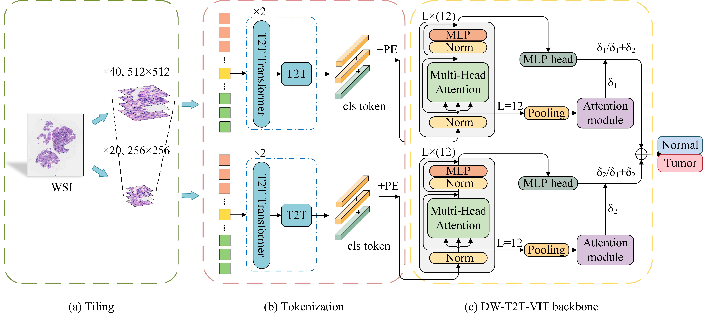

# WS-T2T-ViT
## Weakly Supervised Classification for Nasopharyngeal Carcinoma with Transformer in Whole Slide Images
The study presents an approach to predict Nasopharyngeal Carcinoma from H&E histology slides using Vision Transformer.

Code for WS-T2T-ViT described in the aforementioned paper.


## Contents
- [Pre-requisites and Environmen](#Pre-requisites-and-Environmen)
- [Data Preparation](#Data-Preparation)
- [K-fold Cross Validation](#K-fold-Cross-Validation)
## Pre-requisites and Environment
### Pre-requisites
* Linux (Tested on Ubuntu 18.04)
* NVIDIA GPU (Tested on Nvidia GeForce RTX 3090) 
* Python (3.8.16), OpenCV (4.8.1), Openslide-python (1.3.1) and Pytorch (1.9.1)

### Environment Configuration
1. Create a virtual environment and install PyTorch. In the 3rd step, please select the correct Pytorch version that matches your CUDA version from [https://pytorch.org/get-started/previous-versions/](https://pytorch.org/get-started/previous-versions/).
   ```
   $ conda create -n wsvit python=3.8.16
   $ conda activate wsvit
   $ pip install torch==1.9.1+cu111 torchvision==0.10.1+cu111 torchaudio==0.9.1 -f https://download.pytorch.org/whl/torch_stable.html
   ```
      *Note:  `pip install` command is required for Pytorch installation.*


2. To try out the Python code and set up environment, please activate the `wsvit` environment first:

    ``` shell
    $ conda activate wsvit
    $ cd wsvit/
    ```
3. For ease of use, you can just set up the environment and run the following:
   ``` shell
   $ pip install -r requirements.txt
   ```

## Data Preparation
### Slide preparation
Make the `./DATA` folder, download whole slide images there, and then organize them into the following structure.  
```bash
DATA
└── WSI
    ├── slide_1
    ├── slide_2
    ├── slide_3
  
```
### Segmentation and Patching
We use [preProcessing code](https://github.com/KatherLab/preProcessing) to segment and patch whole slide images. Simply run:
```
python extractTiles-ws.py -s ./DATA/WSI -o ./DATA/Tiles
```
We set `patch_size` and `manification` to 256 for x20  magnification and to 512 for x40  magnification. After segmentation and patching, the `DATA` directory will look like the following
```bash
DATA/
├── Tiles
│    ├── BLOCKS_X20
│           ├── slide_1
│           ├── slide_2
│           ├── slide_3
│               ├── slide_3_patch_1
│               ├── slide_3_patch_2
│               ├── slide_3_patch_3
│               └── ...
│           └── ...
│    └── BLOCKS_x40
│           ├── slide_1
│           ├── slide_2
│           ├── slide_3
│               ├── slide_3_patch_1
│               ├── slide_3_patch_2
│               ├── slide_3_patch_3
│               └── ...
│           └── ...
│   
└── WSI

```
## K-fold Cross Validation
After data preparation, WS-T2T-ViT can be trained and tested in a k-fold cross-validation by calling:
``` shell
$ CUDA_VISIBLE_DEVICES=0 python main.py
```
